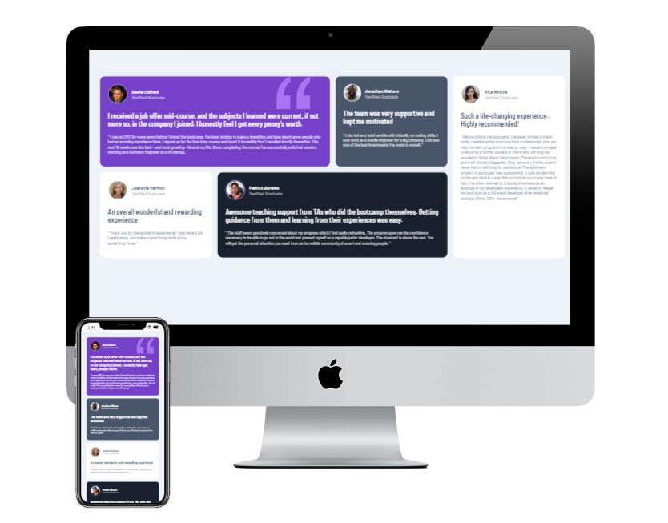

# Testimonials grid section solution

This is a solution to the [Testimonials grid section challenge on Frontend Mentor](https://www.frontendmentor.io/challenges/testimonials-grid-section-Nnw6J7Un7). 

## Table of contents

- [Overview](#overview)
  - [The challenge](#the-challenge)
  - [Screenshot](#screenshot)
  - [Links](#links)
- [My process](#my-process)
  - [Built with](#built-with)
  - [What I learned](#what-i-learned)

## Overview

### The challenge

Users should be able to:

- View the optimal layout for the site depending on their device's screen size

### Screenshot

### Links
- Live Site URL: [https://lidijaal.github.io/TestimonialsGrid/](https://lidijaal.github.io/TestimonialsGrid/)

## My process

### Built with

- HTML5
- CSS

### What I learned

I learned about different ways of using CSS Grid to build a responsive web page. 
